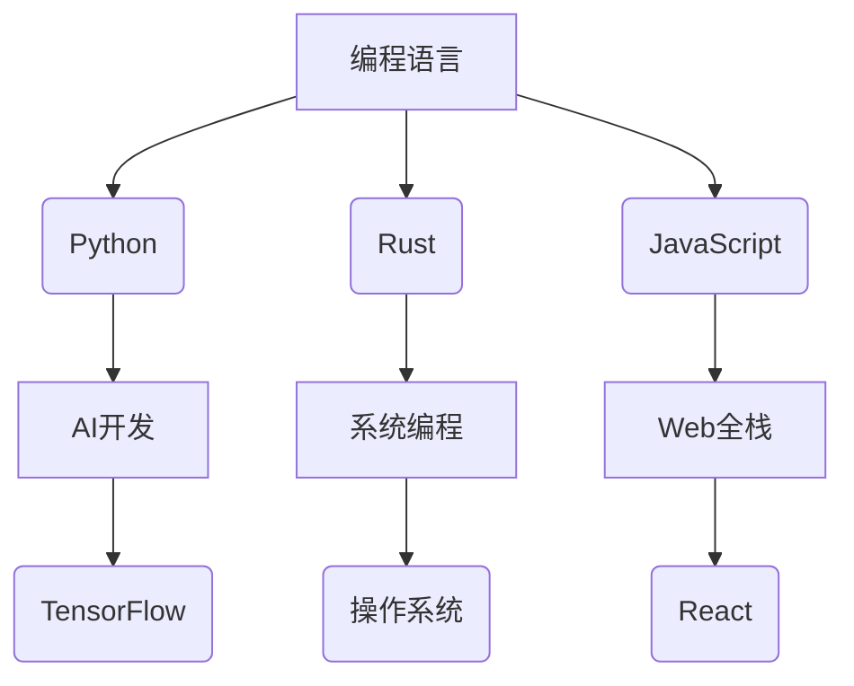

  <h1> 
    
  </h1>

  <!-- 3D校徽旋转 -->
  

<!-- 动态技能雷达图 -->

---

## 🚀 实时数据仪表盘
<!-- 可交互数据面板 -->
|  |  |
| ------------- | ------------- |

---

## 🔥 热点项目
<!-- 带动态预览的项目卡片 -->

---

## 🌌 技术星系图

# 👋 Hi, I'm [你的名字]！

Welcome to my GitHub profile! I'm a passionate developer and tech enthusiast. 🚀 I love exploring new technologies and creating cool projects that push the boundaries of innovation. Below you'll find some of my recent work, contributions, and a little bit about me!

---

## 🧑‍💻 About Me

- 💻 I'm a **[你的职业/角色]** at **[公司名/学校名]**.
- 🧑‍🔬 Currently exploring **[你目前的兴趣技术领域]**.
- 🌱 Always learning and improving my skills in **[相关技术栈]**.
- 🔭 I'm working on **[你目前的项目/方向]**.
- 🌐 You can also find me on:
  - [LinkedIn](https://www.linkedin.com/in/你的LinkedIn/)
  - [Twitter](https://twitter.com/你的Twitter)
  - [个人网站](https://你的个人网站链接)

---

## 💡 Technologies I Love

- **Languages**: JavaScript, Python, TypeScript, C++
- **Frameworks**: React, Node.js, Express, Django
- **Tools**: Docker, Kubernetes, Git, VS Code
- **Cloud**: AWS, Google Cloud Platform
- **Databases**: PostgreSQL, MongoDB
- **Others**: CI/CD, Machine Learning, Blockchain

---

## 🚀 Recent Projects

### 1. **[项目名 1]**
   - Description: A brief description of the project, what it does, and the technologies used.
   - 🔗 [Live Demo](https://你的项目链接)
   - 🔧 Tech Stack: React, Node.js, MongoDB
   - 📚 GitHub Repo: [链接到项目](https://github.com/你的用户名/项目名称)

### 2. **[项目名 2]**
   - Description: A brief description of the project, what it does, and the technologies used.
   - 🔧 Tech Stack: Python, Flask, PostgreSQL
   - 📚 GitHub Repo: [链接到项目](https://github.com/你的用户名/项目名称)

---

## 📊 GitHub Stats

---

## 📍 Where to Find Me

- GitHub: [你的GitHub](https://github.com/你的用户名)
- Twitter: [你的Twitter](https://twitter.com/你的Twitter)
- LinkedIn: [你的LinkedIn](https://www.linkedin.com/in/你的LinkedIn)

---

## ⚡ Fun Facts

- I love solving coding challenges and have a passion for open-source software.
- I enjoy reading about the latest advancements in AI and blockchain technologies.
- When I'm not coding, you can find me exploring the world of virtual reality and sci-fi!

---

Feel free to explore my repositories and get in touch if you have any interesting project ideas or questions! 👾

---
